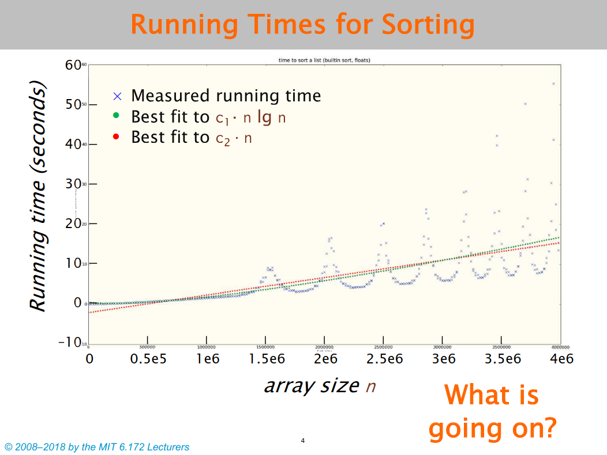
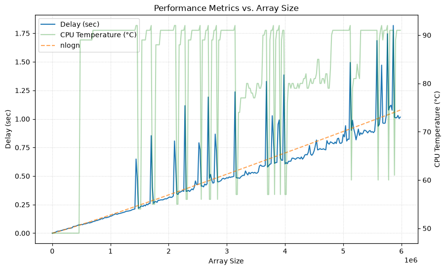
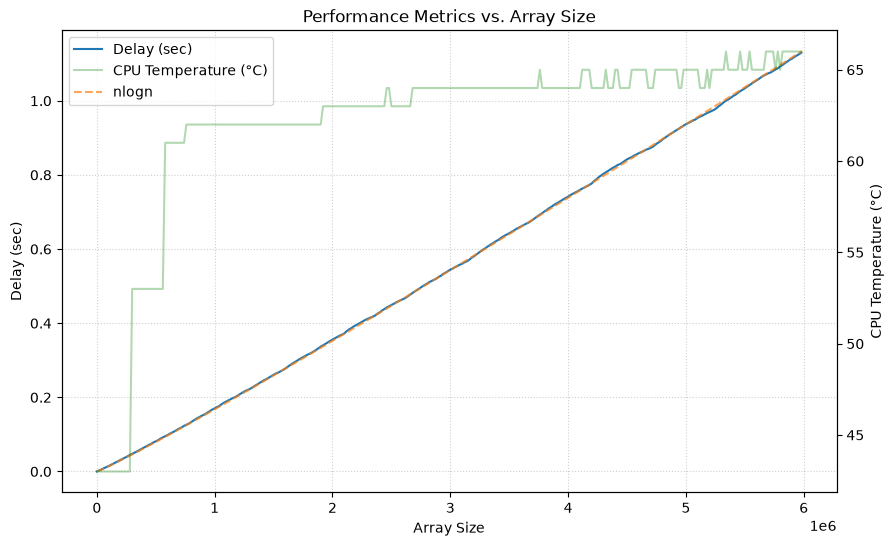

# DVFS-performance-anomalies

This project is a simulation and study of performance measurement anomalies in software engineering, specifically focusing on the timing of a **merge sort** routine. Inspired by a study by presented in MIT’s Performance Engineering course, the project demonstrates how modern hardware features like **Dynamic Frequency and Voltage Scaling (DVFS)** can create "roller coaster" patterns in execution time rather than a smooth algorithmic growth curve. By measuring the runtime of sorting increasingly large arrays using `CLOCK_MONOTONIC`, this simulation exposes how system noise and thermal throttling wreak havoc on deterministic performance data.
By measuring the runtime of sorting increasingly large arrays using `CLOCK_MONOTONIC`, this simulation exposes how system noise and thermal throttling wreak havoc on deterministic performance data.


*This image shows the "roller coaster" effect in timing measurements, as presented in MIT's Performance Engineering course [2].*

To obtain reliable and repeatable results, I have performed **"quiescing system"** as part of this project.

## Background

This section covers foundational concepts from the relevant literature [1, 2, 3].

### "Producing Wrong Data Without Doing Anything Obviously Wrong"
This paper, authored by **Mytkowicz et al.**, is a foundational reference in performance engineering. It demonstrates that performance measurements can be significantly biased by "seemingly irrelevant" factors that shift memory alignment. For example:
*   **Linker Order:** Changing the order of `.o` files in a linker command can have a larger impact on performance than moving from `-O2` to `-O3` optimization levels.
*   **Program Name Length:** Because an executable's name is stored in an environment variable on the call stack, simply lengthening a program's name can shift stack alignment and slow down data access by causing it to cross page boundaries.

## Method

### Quiescing a System
**Quiescing a system** refers to the process of making a computer "quiet" enough to obtain reliable and repeatable timing measurements by eliminating external "noise". Based on the sources, this involves several core concepts:

#### The Purpose: Reducing Variance
The primary goal of quiescing is to **reduce variability**. Following the quality control theories of **Genichi Taguchi**, it is essential to minimize the "spread" (variance) of data before attempting to improve a product. In software, high variance makes it impossible to determine if a code change actually improved performance or if the result was merely a byproduct of random noise. A properly quiesced system should produce essentially the same runtime for a deterministic program every time it is executed.

#### Common Sources of "Noise"
Modern systems contain numerous features that interfere with clean measurements:
*   **System Activity:** Background jobs (daemons), periodic cron jobs, and interrupts from network traffic or even mouse movements.
*   **Hardware Features:** **DVFS**, which adjusts clock speeds based on heat, and **Turbo Boost**, which increases speeds inconsistently depending on how many cores are active.
*   **Architectural Features:** **Hyperthreading**, which shares functional units between instruction streams, and the operating system’s tendency to use **Core 0** for system interrupt handlers.

#### How to Quiesce a System
To quiesce the system for these experiments, the following actions were recommended and implemented:
*   **Shut down external interference:** All other applications were closed, daemons and cron jobs were shut down, and the network was disconnected.
*   **Hands off:** No interaction with the mouse or keyboard occurred during measurements, as these generate frequent interrupts that disrupt timing.
*   **Disable dynamic hardware scaling:** Features like DVFS, Turbo Boost, and hyperthreading were disabled to ensure the processor maintained a constant frequency.
*   **Isolate the process:** To avoid Core 0's interrupt traffic, the program was "pinned" to specific cores using the `taskset` utility, preventing the operating system from moving threads between cores during execution.

#### Demonstrated Effectiveness
The sources demonstrate the effectiveness of this process through an experiment using a Cilk program. In a standard, "noisy" environment, the slowest runs were **almost 25% slower** than the fastest runs. After quiescing the system—specifically by turning off Turbo Boost, hyperthreading, and background daemons—the variance dropped significantly, with nearly all 100 runs producing the exact same value within a margin of **less than 1%**.

## Describing Files

* **`mergesort_benchmark.c`**: This C program performs the merge sort benchmark. It sorts an array of up to 6,000,000 elements, measures the execution time and CPU temperature for different array sizes, and saves the results in a CSV file.
* **`notebook.ipynb`**: A Jupyter notebook used for plotting and visualizing the results.
* **`measurements_noisy.csv` & `measurements_quiesce.csv`**: Two CSV result files storing the output data from runs before and after quiescing the system.

## How to Run

To run the benchmark, first compile the code with GCC using the `-O2` optimization flag:

```bash
gcc -O2 mergesort_benchmark.c -o mergesort_benchmark
```

Then, execute the program:

```bash
./mergesort_benchmark
```

The execution will take a couple of minutes. Once completed, the result will be saved in a `measurements.csv` file. You can then use the `notebook.ipynb` notebook to plot the data.

## Results

I performed two time measurements: one in a noisy laptop environment, and one after quiescing the laptop.

**Measurement in a noisy laptop:**


**Measurement after quiescing the laptop:**


## Discussion and Conclusion

After quiescing the system, the delay curve becomes a straight line, and the CPU temperature stabilizes. This shows that the system is in a deterministic state, eliminating the anomalies and producing reliable, repeatable measurement data.

## System settings

| Property | Value |
|----------|-------|
| Benchmark | Merge Sort |
| CPU | Intel® Core™ i7-6700HQ |
| Architecture | x86_64 |
| Physical Cores | 4 |
| Logical CPUs | 8 |
| Threads per Core | 2 |
| Base Frequency | 2.60 GHz |
| Maximum Frequency | 3.50 GHz |
| L1d Cache | 128 KiB |
| L1i Cache | 128 KiB |
| L2 Cache | 1 MiB |
| L3 Cache | 6 MiB |
| Memory | 12 GiB RAM, 4 GiB Swap |
| Operating System | Ubuntu 25.10 |
| Kernel | Linux 6.17.0-14-generic |
| Compiler | GCC 15.2.0 |
| Compiler Flags | `-O2` |

## References

[1] MIT OpenCourseWare, 10. Measurement and Timing, (Sep. 23, 2019). Accessed: Jul. 13, 2026. [Online Video]. Available: https://www.youtube.com/watch?v=LvX3g45ynu8

[2] C. E. Leiserson, “MEASUREMENT AND TIMING,” [Online]. Available: https://ocw.mit.edu/courses/6-172-performance-engineering-of-software-systems-fall-2018/4d7f4bb31bf1ed90c669a11867d36d36_MIT6_172F18_lec10.pdf

[3] “Producing wrong data without doing anything obviously wrong!,” ACM SIGPLAN Notices, Accessed: Jul. 14, 2026. [Online]. Available: https://dl.acm.org/doi/10.1145/1508284.1508275

